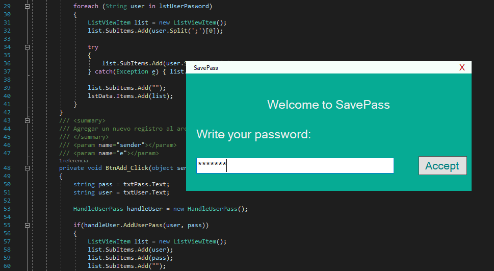

# SavePass: Save your passwords

> Password for use App: *Pass: Hours Day Month Year*

Example:

 Then, your password: Pass: 2214102019

> For Add:

Enter your username and password. Then click on add

> For Delete:

Enter the username you wish to delete, then click delet

> For Update:

Enter the username yo wish to update, then click update

> Description:

Language: C# .NETFramework,Version=v4.7.2

Tested on windows systems

Version: 1.1.2

Status: Completed
